# Hi there, I'm Harisankar G (@Doctor1018) 👋

  

 

  <b>Passionate AI & Software Engineer</b> specializing in Deep Learning, Computer Vision, Medical Image Segmentation, RAG Systems, and Cloud-Native Pipelines.

  
  
  

---

## 🛠️ Technical Skills

### 💻 Programming Languages

### 🧠 Deep Learning & Machine Learning

### 📚 Libraries & Frameworks

### ⚙️ Software Development & Engineering

### ☁️ Cloud & Tools

---

## 🌐 Languages

- 🗣️ **Malayalam**: Native
- 🗣️ **English**: Read, Write, Speak
- 🗣️ **Hindi**: Read, Write, Speak
- 🗣️ **Tamil**: Speak
- 🗣️ **German**: Read

---

## 🚀 Featured Technical Projects

| Project | Description | Tech Stack | Repository |
| :--- | :--- | :--- | :---: |
| **💾 Smart Storage Optimizer** | ML workload classification (Random Forest), BLAKE3 hashing, entropy analysis, drift detection (98.2% constraint compliance). | Python, PyTorch, SQLite, FastAPI, BLAKE3 | [`View Repo`](https://github.com/Doctor1018/AI-Driven-Smart-Storage-Optimizer) |
| **🤖 Workspace RAG Assistant** | Local document intelligence AI agent with ChromaDB, LangChain, & FastAPI RAG search. | FastAPI, ChromaDB, LangChain, PyTorch, Docker | [`View Repo`](https://github.com/Doctor1018/Personal-Workspace-Assistant) |
| **🧠 Brain Tumor Segmentation** | Medical MRI image segmentation using 3D U-Net on BraTS dataset achieving **0.9284 Dice Score**. | PyTorch, U-Net, OpenCV, BraTS, Python | [`View Repo`](https://github.com/Doctor1018/Brain-Tumor-Segmentation) |
| **🛡️ Network Intrusion Classifier** | Machine learning threat classification pipeline on NSL-KDD dataset detecting zero-day cyberattacks. | Python, Scikit-Learn, XGBoost, Pandas | [`View Repo`](https://github.com/Doctor1018/Network-Intrusion-Detection) |
| **🎵 YouTube Music Extension** | Chrome extension for YouTube Music automation, global hotkeys, & Web Audio API equalizer. | JavaScript, Chrome API, HTML5/CSS3 | [`View Repo`](https://github.com/Doctor1018/YouTube-Music-Extension) |
| **✂️ CREDENCE Neural Pruning** | Dynamic neural network pruning & channel gating algorithm for CIFAR-10 inference speedup. | PyTorch, Torchvision, Python | [`View Repo`](https://github.com/Doctor1018/CREDENCE) |

---

## 🎮 Contribution Grid Tic-Tac-Toe

  

---

## 📊 GitHub Analytics

  
  

 

  

---

## 📫 Let's Connect!

- **LinkedIn**: [linkedin.com/in/harisankar-g1018](https://www.linkedin.com/in/harisankar-g1018/)
- **Portfolio**: [doctor1018.github.io](https://doctor1018.github.io)
- **Email**: [harisankarg1018@gmail.com](mailto:harisankarg1018@gmail.com)

  <i>"Most good programmers do programming not because they expect to get paid or get adulation by the public, but because it is fun to program."</i> 
  <b>― Linus Torvalds</b>

